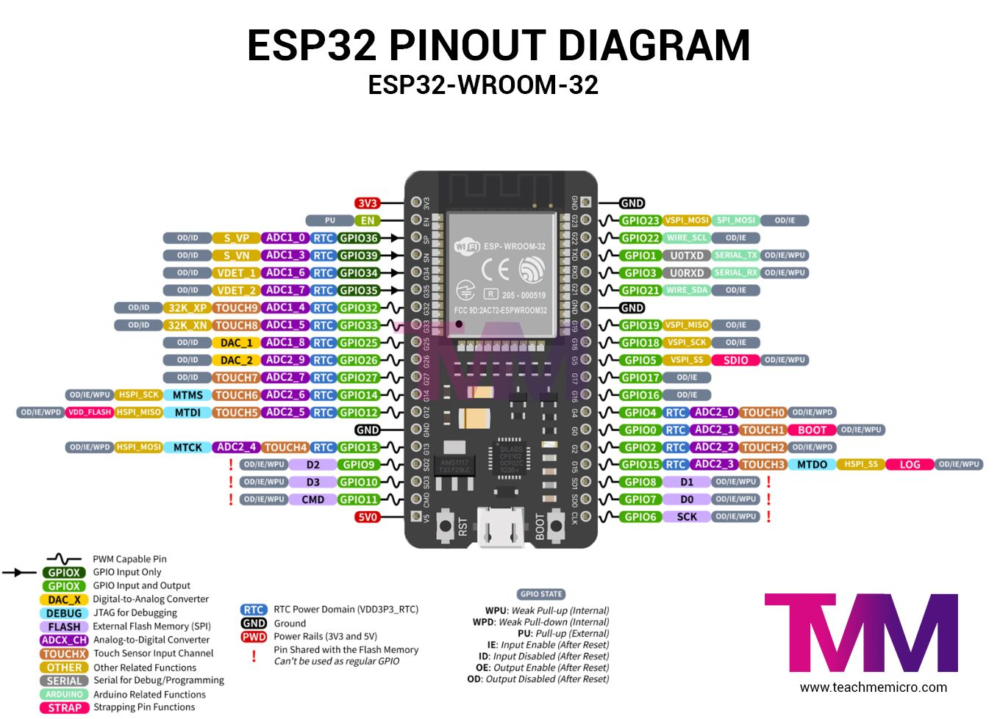

## Internet-of-Things-Workshop
Exercises from the Internet-of-Things (IoT) Workshop during Summer 2025.

Hands-on IoT projects with:

- **Arduino UNO** - Sensor Interfacing and the Physics behind Sensors.
- **ESP32** - Wireless Communication via WLAN and Bluetooth.
- **MQTT** - Simulating Message Queuing Telemetry Transport (MQTT) Protocol using Mosquitto Broker and Wokwi Simulator.

### 📦 Setting up Environment

#### 🛠️ Arduino IDE

- Download the latest [Arduino IDE](https://www.arduino.cc/en/software/) Installer for Windows.

#### 📚 Libraries

- In Arduino IDE, to install libraries:
    - Go to **Sketch → Include Library → Manage Libraries**
    - Search for a library and click install.

1. [DHTlib by Rob Tillaart](https://github.com/RobTillaart/DHTlib) - Lightweight Arduino library for DHT11, DHT22, DHT33, DHT44 sensors.

2. [Stepper Library Reference](https://docs.arduino.cc/libraries/stepper/) - Official Arduino Stepper.h library documentation.


#### 🤔 Arduino IDE for ESP32

- Manage and Install Board Supports: 
    - Go to **Tools → Board → Boards Manager**
    - Search for "ESP32" and Install **ESP32 by Espressif Systems**.

- Install [CP210x USB to UART Bridge VCP Drivers](https://www.silabs.com/developer-tools/usb-to-uart-bridge-vcp-drivers?tab=downloads) from Silicon Labs.

- Now, for Arduino-ESP32 Support, Go to **Prefrences > Additional Board Manager URLs** and paste the following Package URL:

    ```
    https://dl.espressif.com/dl/package_esp32_index.json
    ```
    For more details, visit [Espressif: Arduino-ESP32](https://github.com/espressif/arduino-esp32) repository.

#### 🛠️ Additional Software

- Download [Serial Bluetooth Terminal](https://play.google.com/store/apps/details?id=de.kai_morich.serial_bluetooth_terminal) - Terminal app for Connecting Microcontrollers/Arduino/UART devices via Bluetooth-to-Serial Converters.

### 📌 Pin Diagrams

#### Arduino
<p align=center>
    
</p>

#### ESP32
<p align=center>
    
</p>