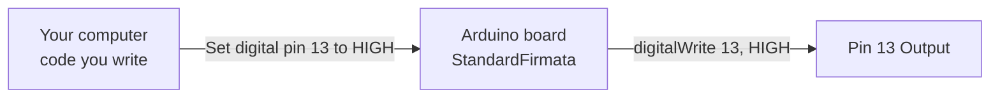

## [PyFirmata2](https://github.com/berndporr/pyFirmata2)
Python Library for controlling Arduino Boards using the [Firmata](https://github.com/firmata/protocol) Protocol.

### 🤔 What is Firmata?
Firmata is a communication protocol designed for scenarios where you need to control Arduino from another device.

- When to use:
    - You want computer-based logic controlling Arduino hardware.
    - You need dynamic Arduino behavior without re-uploading firmware.

### 📦 Quick Setup

1. Install PyFirmata2 with PIP Package Manager.
    ```bash
    pip install pyfirmata2
    ```

2. Flash StandardFirmata to Arduino
    - Go to **File → Examples → Firmata → StandardFirmata**.
    - Upload the StandardFirmata Sketch to your Arduino board.

3. Run the main.py code for basic LED Blinking.
    ```python
    from time import sleep
    import pyfirmata2

    ARDUINO_PORT = 'COM5'

    try:
        board = pyfirmata2.Arduino(ARDUINO_PORT)
        
        led_pin = board.digital[13]
        led_pin.mode = pyfirmata2.OUTPUT

        while True:
            led_pin.write(1)
            sleep(1)
            led_pin.write(0)
            sleep(1)

    except KeyboardInterrupt:
        print("Stopping...")
        led_pin.write(0)
        board.exit()

    except Exception as e:
        print(f"Exception: {e}")
        print("Make Sure Board is Connected and StandardFirmata is Uploaded!")
    ```

What Firmata does for you:



- Your Python code sends a high-level command: "Set digital pin 13 to HIGH".
- StandardFirmata firmware receives this command and translates it.
- Arduino executes the actual hardware function: digitalWrite(13, HIGH).
- Pin 13 outputs HIGH voltage (LED turns on, etc.).